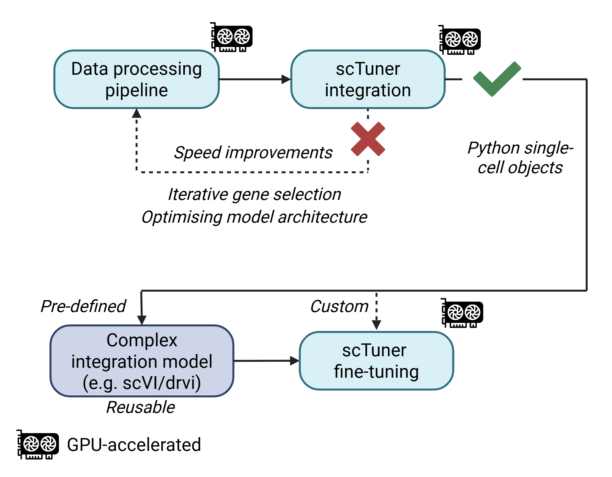
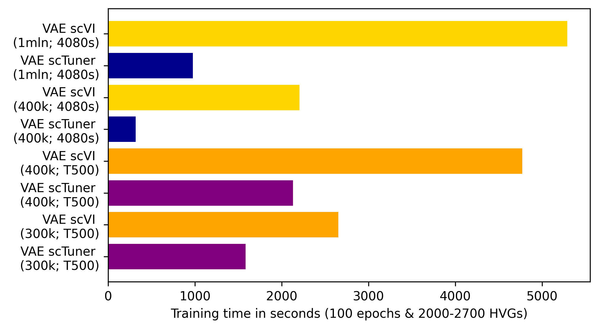

# `scTuner`

[](https://badge.fury.io/py/sctuner)
[](https://github.com/Arts-of-coding/scTuner/actions/workflows/ci-cd.yml)

A repository to easily use or tune single cell models, such as variational autoencoders (VAEs), constructed from large single cell datasets. Additionally, these models can be fine-tuned with smaller datasets, which speeds up the downstream analysis of smaller datasets.

## Schematic overview of how scTuner can be used


## Model availability
This repository contains its own (GPU-accelerated with CUDA) VAE (constructed with PyTorch). Currently the AdEMAMix Optimiser is implemented from https://arxiv.org/abs/2409.03137.

## Installation and usage
### GPU-accelerated processing pipeline powered by ScaleSC
Installing scTuner on top of ScaleSC (needed for the GPU-accelerated) pipeline. First install ScaleSC as instructed (see below or https://github.com/interactivereport/ScaleSC):
```
$ conda activate scalesc
(scalesc) $ pip install uv # greatly speeds up pip installation of scTuner
(scalesc) $ uv pip install sctuner[gpu]
```
Within this activated environment, scTuner's functions 'hvg_batch_processing' and 'extract_hvg_h5ad' can be run. This enables downstream parquet processing with Polars rapids.

After the GPU-accelerated pipeline, the data can be easily processed by defining the main and subfolders with single-cell data:
```
main_dir = "tests/pytestdata/"
subfolders = [ f'{main_dir}{f.name}/' for f in os.scandir(main_dir) if f.is_dir() ]
data_dir_list = subfolders

outdir = f"{main_dir}"
feature_file = f"{main_dir}features_scalesc_outer_joined.txt"
```

### scTuner's parquet processing
With having defined this input a parquet processing pipe can be run:
```
args = [{},                                             # pqsplitter kwargs
        {},                                             # pqconverter kwargs e.g. "dtype_raw":"UInt32"
        {"low_memory":True}]  #                         # pqmerger kwargs

pqpipe = Parquetpipe(data_dir_list, feature_file, outdir)
pqpipe.setup_parquet_pipe(*args)
```

This generates "joined_dataset.parquet" (log1p normalized) and "joined_dataset_raw.parquet" (containing raw counts). The rationale here is that the log1p normalized parquets can almost be instantly converted to PyTorch tensors, skipping the step of underneath conversion and requiring less compute (see benchmarking plot below).

### scTuner's model training and latent dimension retrieval
The remaining API was inspired by scVI for ease of use:
```
import sctuner as sct
device = torch.device("cuda" if torch.cuda.is_available() else "cpu")

# Define the input parquet file & features (already log1p normalized)
path_parquet = 'joined_dataset.parquet'
feature_file = "features_scalesc_outer_joined.txt"

result = sct.models.setup_parquet(parquet_path=path_parquet, feature_file_path=feature_file)

# Load in the dataset into PyTorch's DataLoader
train_loader_train = DataLoader(result, batch_size=512, shuffle=True, pin_memory=True, num_workers=4)

# Initialize the model and optimizer
model = sct.vae.VAE(input_dim=result.shape[1]).to(device)
optimizer_AdEMAMix = sct.optimisers.AdEMAMix(model.parameters())

# Train the model (VAE from scTuner)
sct.vae.train(model = model, optimizer = optimizer_AdEMAMix, train_loader = train_loader_train, epochs=100, device=device)

# Extract and save the embeddings back to the cpu (often needed for large datasets due to insufficient VRAM)
embeddings = sct.models.extract_embeddings(model, result, device="cpu")

# Save embeddings & model
np.save("embeddings", embeddings)
torch.save(model, "model_vae.pt")

# Convert everything to a standard single-cell object (containing raw counts) for further downstream analysis
adata, embeddings = sct.pqutils.parquet2anndata(f'{output_dir}/joined_dataset_raw.parquet', embeddings_path="embeddings.npy")
adata
```

## Benchmarking training time against state-of-the-art (scVI) integration with scTuner's VAE


## Installing ScaleSC with scTuner
```
$ conda create -n scalesc_sctuner python=3.12.9
$ conda activate scalesc_sctuner
$ pip install uv git pynvjitlink-cu12 # Due to dependency issue with uv
$ uv pip install \
    --extra-index-url=https://pypi.nvidia.com \
    "cudf-cu12==25.2.*" "dask-cudf-cu12==25.2.*" "cuml-cu12==25.2.*" \
    "cugraph-cu12==25.2.*" "nx-cugraph-cu12==25.2.*" "cuspatial-cu12==25.2.*" \
    "cuproj-cu12==25.2.*" "cuxfilter-cu12==25.2.*" "cucim-cu12==25.2.*" \
    "pylibraft-cu12==25.2.*" "raft-dask-cu12==25.2.*" "cuvs-cu12==25.2.*" \
    "nx-cugraph-cu12==25.2.*"
$ uv pip install rapids-singlecell xgboost # Needed for ScaleSC HVG selection
$ git clone https://github.com/interactivereport/scaleSC.git
$ cd scaleSC
$ uv pip install .       # Install the ScaleSC git repo
$ uv pip install sctuner[gpu] --torch-backend=cu126
```

## Acknowledgements
The exceptional documentation of scVI (https://github.com/scverse/scvi-tools) enabled relatively straightforward construction of this package. I recommend trying out their model, especially when dealing with medium sized datasets or after having performed iterative optimisations on large datasets (e.g. having determined the top n genes to perform integration on).

The GPU-accelerated data processing pipeline wrapper in this package was made around ScaleSC (https://github.com/interactivereport/ScaleSC), feel free to check out their package.